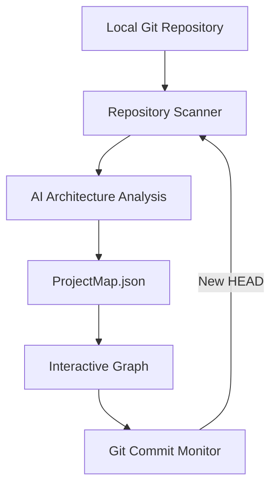

# CodeOrbit

AI coding agents can generate and change large amounts of code quickly. As a project grows, developers can lose their mental model of its services, features, and internal relationships.

CodeOrbit analyzes a local Git repository and turns repository evidence into an interactive architecture and functionality graph. Large nodes represent services or applications, smaller nodes represent meaningful domain features, and labeled edges describe relationships such as `contains`, HTTP, WebSocket, gRPC, `uses`, `manages`, and other connections supported by the code.

CodeOrbit is currently a local web application built for a hackathon. The longer-term direction is a JetBrains plugin that connects project context to JetBrains AI Chat.

## How it works



The backend scans selected text files, asks the configured OpenAI model to identify services, meaningful features, and evidence-based relations, validates the structured result, and writes `ProjectMap.json` into the analyzed repository.

After the initial load, the backend monitors Git `HEAD`. A new commit follows the normal refresh path:

```text
new Git commit
→ repository scan
→ AI analysis
→ validation
→ ProjectMap update
→ updated graph on the next frontend fetch
```

This automatic commit-monitor flow has been tested end to end.

## Node actions

Each service or feature node exposes four actions:

| Action | Current behavior | AI request |
|---|---|---:|
| **To Chat** | The backend prepares real context for the selected node. The web MVP demonstrates what could later be sent to JetBrains AI Chat in a mock chat window. | No |
| **Test** | Displays deterministic mock test results for the selected node. It does not discover or execute repository tests. | No |
| **Explain** | Prepares a contextual explanation prompt for the mock chat input. It does not generate an explanation. | No |
| **Audit** | The backend analyzes the selected node using its repository evidence and returns structured scores plus two actionable improvements. | Yes |

Audit returns an overall score, optimization score, maintainability score, and exactly two improvements. Its backend endpoint has been tested with a real `gpt-5.6-terra` request, including Structured Output and local validation. The current frontend Audit button is not yet wired to that endpoint.

See [Node Actions: Frontend Integration](docs/NODE_ACTIONS_FRONTEND.md) for the API contracts and intended UI behavior.

## Tech stack

### Frontend

- React 19 and TypeScript
- Vite 8
- React Flow (`@xyflow/react`)
- Tailwind CSS 4
- React Router
- Base UI and shadcn components

### Backend

- Node.js and TypeScript
- Fastify 5
- SQLite through Node's built-in `node:sqlite` module
- OpenAI Responses API with strict Structured Outputs
- Git CLI for repository validation, commit history, and `HEAD` monitoring

## Project structure

```text
jetbrains/
├── backend/    # API, scanner, AI analysis, ProjectMap storage, and Git monitoring
├── frontend/   # React web interface and interactive graph
└── docs/       # Architecture notes and frontend/backend integration contracts
```

The backend and frontend are separate npm projects with separate dependency installations.

## Prerequisites

- Node.js 26 or newer
- npm
- Git
- An OpenAI API key for initial project analysis, automatic commit refreshes, and Audit
- A local Git working tree to analyze

## Installation

From the repository root, install each application separately.

### Backend

```bash
cd backend
npm install
```

### Frontend

Open another terminal or return to the repository root first:

```bash
cd frontend
npm install
```

Both directories include `package-lock.json`, so `npm ci` can be used instead when a clean, lockfile-exact installation is preferred.

## Environment setup

Create the backend environment file:

```bash
cd backend
cp .env.example .env
```

Then set `OPENAI_API_KEY` in `backend/.env`. Never commit this file or share its contents.

```dotenv
PORT=3000
DATABASE_PATH=.data/projects.sqlite
OPENAI_API_KEY=your_api_key_here
OPENAI_MODEL=gpt-5.6-terra
```

| Variable | Purpose |
|---|---|
| `PORT` | Backend port. Defaults to `3000`. |
| `DATABASE_PATH` | SQLite file path. Defaults to `.data/projects.sqlite` relative to the backend working directory. |
| `OPENAI_API_KEY` | Required when an operation makes an OpenAI request. |
| `OPENAI_MODEL` | Optional model override. Defaults to `gpt-5.6-terra`. |

The frontend uses `http://127.0.0.1:3000` as its backend by default. To override it, create `frontend/.env` from `frontend/.env.example` and change `VITE_API_BASE_URL`.

## Running CodeOrbit

Run the applications in two terminals from the repository root.

### Terminal 1 — Backend

```bash
cd backend
npm run dev
```

The backend API listens on [http://127.0.0.1:3000](http://127.0.0.1:3000) by default.

### Terminal 2 — Frontend

```bash
cd frontend
npm run dev
```

Open [http://localhost:5173](http://localhost:5173) in a browser. Vite prints the active URL if port `5173` is already occupied.

## Using CodeOrbit

1. Start the backend.
2. Start the frontend and open it in a browser.
3. Add a local Git repository using the project picker.
4. Start the initial analysis. This creates `ProjectMap.json` in the selected repository.
5. Explore the discovered services, features, and labeled relations.
6. Open node actions from a service or feature.
7. Make code changes and create a Git commit in the analyzed repository.
8. The backend detects the new `HEAD` and automatically refreshes the saved map.
9. Fetch or reopen the graph to view the updated architecture.

Initial analysis, automatic commit refreshes, and Audit require OpenAI API access. To Chat, Test, and Explain do not call OpenAI in the current web MVP.

## Current MVP scope

### Implemented with real repository data

- Local Git repository selection and persistence
- Balanced, architecture-aware repository scanning
- AI service, feature, and relation discovery
- Validated `ProjectMap.json` generation
- Interactive architecture graph rendering
- Git commit monitoring and automatic graph refresh
- Git commit history API
- Selected-node context extraction
- AI-powered node Audit backend

### Demo and integration scope

- Test displays deterministic mock results and does not execute tests.
- To Chat demonstrates the context intended for future JetBrains AI Chat integration.
- Explain demonstrates a ready-to-send contextual prompt.
- The web Audit button still needs to be connected to the implemented Audit endpoint.

The planned JetBrains integration will use the same project and node context inside the IDE and AI Chat.

## Additional documentation

- [Node Actions: Frontend Integration](docs/NODE_ACTIONS_FRONTEND.md) — node action contracts and UI guidance
- [Frontend–Backend Context](docs/FRONTEND_BACKEND_CONTEXT.md) — current API and integration context
- [Project Overview](docs/PROJECT_OVERVIEW.md) — broader product and architecture notes
- [Backend README](backend/README.md) — concise backend API and development notes
